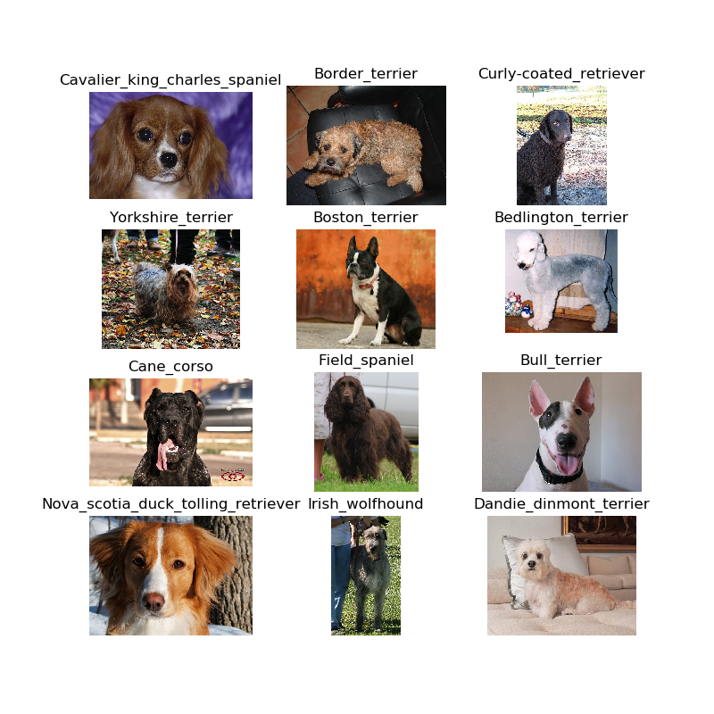
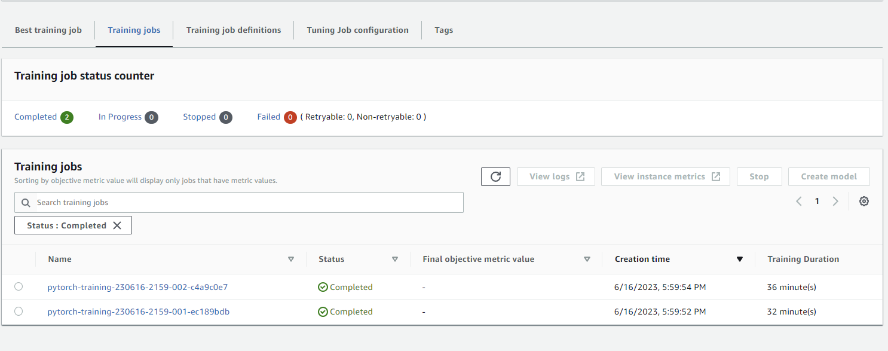
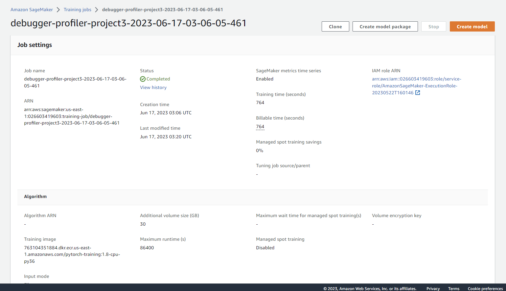
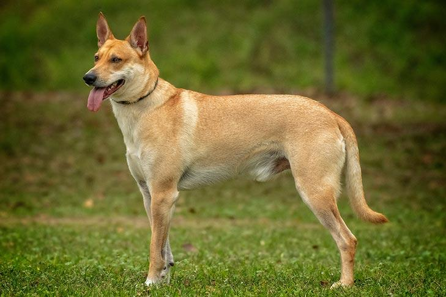
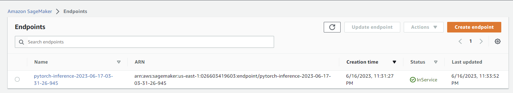
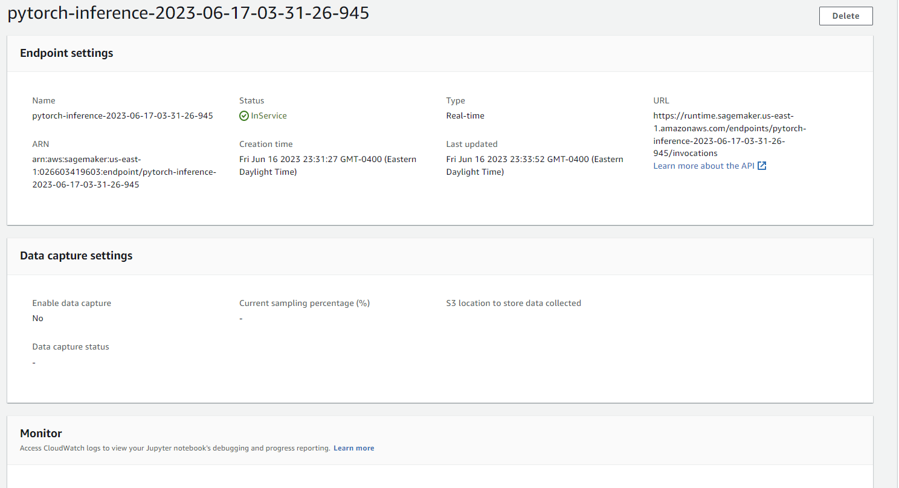

# Image Classification using AWS SageMaker

Use AWS Sagemaker to train a pretrained model that can perform image classification by using the Sagemaker profiling, debugger, hyperparameter tuning and other good ML engineering practices. This can be done on either the provided dog breed classication data set or one of your choice.

## Project Set Up and Installation
Enter AWS through the gateway in the course and open SageMaker Studio. 
Download the starter files.
Download/Make the dataset available. 

## Dataset
The provided dataset is the dogbreed classification dataset which can be found in the classroom.
The project is designed to be dataset independent so if there is a dataset that is more interesting or relevant to your work, you are welcome to use it to complete the project.

### Access
Upload the data to an S3 bucket through the AWS Gateway so that SageMaker has access to the data. 
This is a sample of the data set that was used. 
 DataSet Sample

## Hyperparameter Tuning
The model I used for this project was ResNet50 as it  has demonstrated excellent performance on various computer vision tasks, such as image classification and object detection. Its deep architecture, with 50 layers, enables it to learn complex representations and capture intricate patterns in the data, leading to accurate and reliable predictions.
The hyperparameter's I tuned are Learning rate and Batch size. Choosing an appropriate learning rate is crucial for successful model convergence. If the learning rate is too high, the model may fail to converge, leading to unstable or poor performance. The choice of batch size can impact both the computational efficiency and the quality of the learned model. The ranges I provided and used are as follows: 
"lr": ContinuousParameter(0.001, 0.1),
"batch-size": CategoricalParameter([20, 34, 40, 60, 75]).

 Hyperparameter Tuning Jobs Completed

## Debugging and Profiling
 Debugger Job Completed
[Here the Profiler report can be found](ProfilerReport) Here the Profiler report can be found

### Results
In the Jupiter notebook multiple rules for debugger and profiller were created. An ml.m5.large instance was used which didnt support GPU usage but if GPU usauge was utilized the process could have ended much faster. 
 Test Image

## Model Deployment
For Model Deployment an ml.m5.large instance of 1 was used. The infernce.py was used for Refernece for Modal Deployment, but a pytorch model was used. The End point was deployed and the following was used as a test image. 

